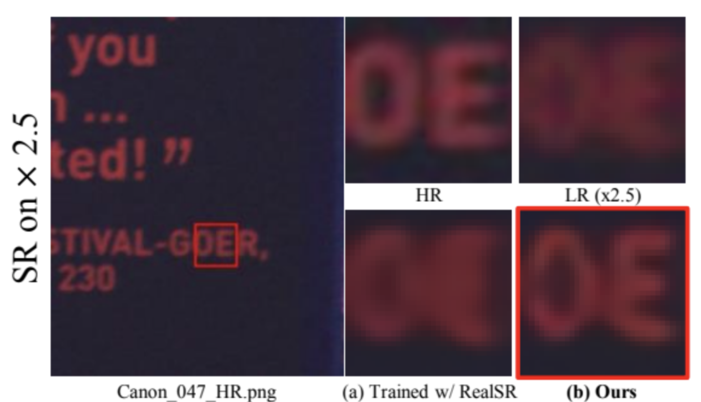
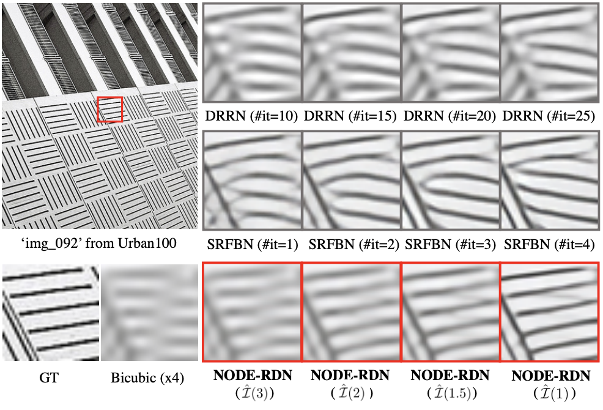
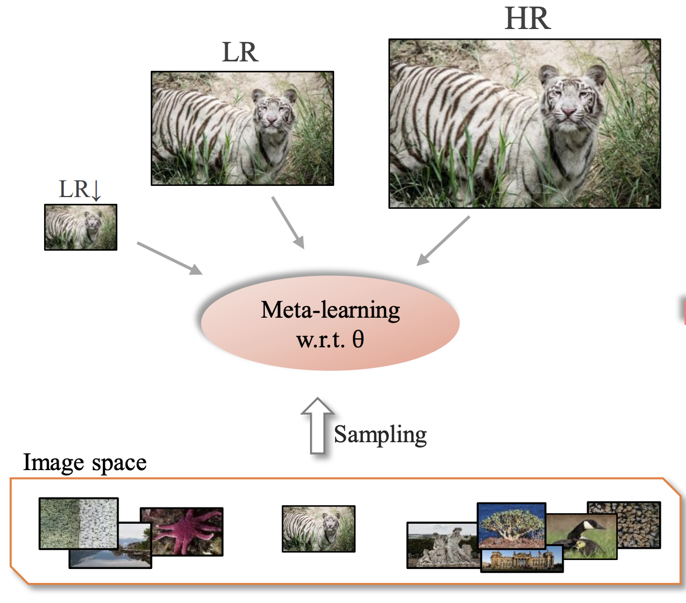

# Hi there 👋

### My name is Seobin Park! 

I'm an M.S. student in computer science at Hanyang University, Seoul, South Korea 🇰🇷.

(expected to graduate in Feb. 2022)

I enjoy discovering <b> new computer vision problems</b> and solve them using novel <b>machine learning</b> methodologies!

 

## ✨ Publications

<!-- ---

 

  
#### Fast adaptation to super-resolution networks via meta-learning

S. Park, J. Yoo, D. Cho, J. Kim, T. H. Kim   European Conference on Computer Vision (ECCV), 2020 -->

<table>
  <tr>
    <td align="center">
      
    </td>
    <td>
      <h3>Modeling degradations for real-world super-resolution via constrained flows</h3>
      
<b>S. Park</b>, D. Kim, T. H. Kim

      
Under Review

    </td>
  </tr>
  
  <tr>
    <td align="center">
      
    </td>
    <td>    
      <h3>Progressive image super-resolution via neural differential equation</h3>
      
<b>S. Park</b>, T. H. Kim

      
IEEE International Conference on Acoustics, Speech and Signal Processing (ICASSP), 2022

      
 <a href="https://arxiv.org/abs/2101.08987" target="_blank">paper</a> | code 

    </td>
  </tr>
  
  <tr>
    <td align="center">
      
    </td>
    <td>
      <h3>Fast adaptation to super-resolution networks via meta-learning</h3>
      
<b>S. Park</b>, J. Yoo, D. Cho, J. Kim, T. H. Kim

      
European Conference on Computer Vision (ECCV), 2020

      
 <a href="https://www.ecva.net/papers/eccv_2020/papers_ECCV/html/5930_ECCV_2020_paper.php" target="_blank">paper</a> | <a href="https://github.com/parkseobin/MLSR" target="_blank">code</a> 

    </td>
  </tr>
  
</table>

<!--
**parkseobin/parkseobin** is a ✨ _special_ ✨ repository because its `README.md` (this file) appears on your GitHub profile.

Here are some ideas to get you started:

- 🔭 I’m currently working on ...
- 🌱 I’m currently learning ...
- 👯 I’m looking to collaborate on ...
- 🤔 I’m looking for help with ...
- 💬 Ask me about ...
- 📫 How to reach me: ...
- 😄 Pronouns: ...
- ⚡ Fun fact: ...
-->
